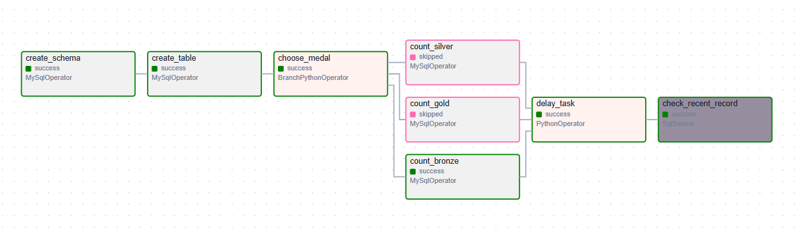
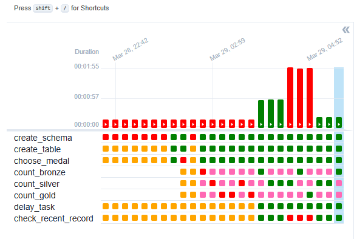

### goit-de-hw-07

# Airflow DAG

## Overview

This project automates the extraction, transformation, and loading (ETL) of Olympic dataset records using Apache Airflow. The DAG manages the creation of tables, data insertion, and querying within a MySQL database.

## Features

- Table Creation: Automatically creates a table (athlete_event_results) in MySQL if it does not exist.

- Data Extraction: Retrieves event results from a specified data source.

- Data Transformation: Processes raw data into a structured format.

- Data Loading: Stores transformed data into the MySQL database.

- Query Execution: Retrieves and logs selected records for validation.

# Files
    vekh_medals.py - DAG
    test_mysql_connection.py - for check connection to DB

## DAG

## Database Schema

    CREATE TABLE IF NOT EXISTS olympic_dataset.athlete_event_results (
        id INT AUTO_INCREMENT PRIMARY KEY,
        medal VARCHAR(6),
        count INT,
        created_at TIMESTAMP DEFAULT CURRENT_TIMESTAMP
    );

## Logging and Debugging

- View task logs in Airflow UI.

- Check the MySQL table using MySQL Workbench or CLI.

- Debug failed tasks using airflow tasks test command.

## Future Improvements

- Implement data validation before inserting into the database.

- Integrate with cloud storage (e.g., AWS S3, Google Cloud Storage).

- Add error handling and notifications.